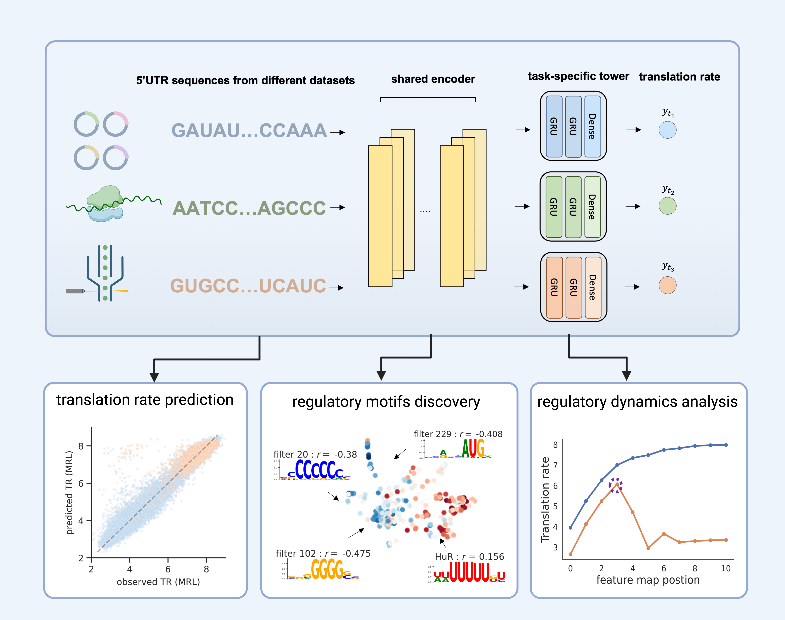

# MTtrans

MTtrans is a multi-task learning framework for integrating translation rate measurement from differet sequencing platforms 
and the discovery. The shared prepresentation captures common patterns acorss techiniques that are used to discover the robust *cis*-regulatory elements. 





MTtrans is implemented with [pytorch](https://pytorch.org/).

 

  

# Getting Start

## 1. configure the running environment
We use `conda` to manage the python packages used in this study, which 
is required for setting up the environment. If you don't have `conda` installed in your machine, please refer to [conda guide](https://docs.conda.io/projects/conda/en/latest/user-guide/install/index.html).
```shell
# clone to local and enter the main directory
git clone https://github.com/holab-hku/MTtrans
cd MTtrans

# make sure you are stay under the main folder
bash script/generate_config_js.sh

# create a new environment and install the prerequisites
conda env create -f util/environment.yml
conda activate MTtrans
```
 
After running the shell script `script/generate_config_js.sh`, you are supposed to see file `machine_configure.json`
under the main directory. This file locates the codes and the data that will be downloaded later.
<span style="color: red;">Please don't change the "script_dir".</span>
The "data_dir" and "pth_dir" record where the datasets and the models will be saved. The default setting is `data/` and `checkpoint/` under the this main folder.


## 2. download the datasets used in this study

There are 7 datasets used in total, including 3 massively parallel report assay (MPA), 3 ribosome profilings (RP) and 1 MPA dataset performed in the yeast system. You can download them by

```shell
# make sure you are stay under the main folder
bash script/download_training_data.sh 
```

Then data preprocessing by

```shell
bash script/data_prepocessing.sh
```

The processed files will all saved to the "data_dir" defined in the `machine_configure.json`. 

## 3. Testing example

Under the terminal, we can call the python script `iter_train.py` to impement MTtrans. All the hyper-parameters and other experimental details like task combination are storaged in the configuration file in the format of `ini`. Let's have a quick tesing run by

```shell
# an one-epoch testing experiment 
python script/iter_train.py --config_file log/Backbone/RL_hard_share/3R/testing.ini
```

If the python script works, you will see the following text popping both in the shell and the 
```python
 - ini file updated    
 - Snapshot saved to <pth_dir>/RL_hard_share_MTL/3R/testing-model_best_cv1.pth
```

The testing model will automatically save to the "pth_dir", which is `checkpoint/` by default.

# Playing with the model

To explore the trained model, we can load in the saved checkpoint to resume the model for later analysis.
Here we use the testing checkpoint file (end with `.pth`) we just trained as the example.

The checkpoints of all kinds of our MTtrans variant is available at https://figshare.com/articles/dataset/MTtrans_Model_weight/24504154.

```shell
# firstly make sure you are in the correct environment
conda activate MTtrans

# then get into your favourite python IDE (i.e jupyter / vscode)
# here I enter the built-in one for demonstration
python
```

```python
>>> import os
>>> import torch
>>> from torchinfo import summary

# paste the checkpoint path here
>>> save_path = "<pth_dir>/RL_hard_share_MTL/3R/testing-model_best_cv1.pth"
>>> assert os.path.exists(save_path) , "please repalce <pth_dir> with the correct path set in your machine"

# resume in the 'cpu' 
>>> model = torch.load(save_path, 'cpu')['state_dict']

# an overview of the model
>>> summery(model)
=====================================================================
Layer (type:depth-idx)                        Param #
======================================================================
RL_hard_share                                 --
├─Conv1d_block: 1-1                           --
│    └─ModuleList: 2-1                        --
│    │    └─Sequential: 3-1                   1,920
│    │    └─Sequential: 3-2                   99,072
│    │    └─Sequential: 3-3                   394,752
│    │    └─Sequential: 3-4                   787,968
├─ModuleDict: 1-2                             --
│    └─ModuleList: 2-2                        --
│    │    └─GRU: 3-5                          181,440
│    │    └─Linear: 3-6                       81
│    └─ModuleList: 2-3                        --
│    │    └─GRU: 3-7                          181,440
│    │    └─Linear: 3-8                       81
│    └─ModuleList: 2-4                        --
│    │    └─GRU: 3-9                          181,440
│    │    └─Linear: 3-10                      81
│    └─ModuleList: 2-5                        --
│    │    └─GRU: 3-11                         181,440
│    │    └─Linear: 3-12                      81
│    └─ModuleList: 2-6                        --
│    │    └─GRU: 3-13                         181,440
│    │    └─Linear: 3-14                      81
├─Linear: 1-3                                 81
├─MSELoss: 1-4                                --
======================================================================
Total params: 2,191,398
Trainable params: 2,191,398
Non-trainable params: 0
======================================================================
>>>exit()
```

# References:

We sincerely thanks all the listed authors for making their data publicly available.

> Cuperus, J.T., Groves, B., Kuchina, A., Rosenberg, A.B., Jojic, N., Fields, S., Seelig, G.: Deep learning of the
regulatory grammar of yeast 5 untranslated regions from 500,000 random sequences. Genome Research 27(12),
2015{2024 (2017) [link](https://genome.cshlp.org/content/27/12/2015.full)

> Sample, P.J., Wang, B., Reid, D.W., Presnyak, V., McFadyen, I.J., Morris, D.R., Seelig, G.: Human 5 utr
design and variant effect prediction from a massively parallel translation assay. Nature Biotechnology 37(7),
803{809 (2019) [link](https://www.nature.com/articles/s41587-019-0164-5)

> Andreev, D.E., O’Connor, P.B., Fahey, C., Kenny, E.M., Terenin, I.M., Dmitriev, S.E., Cormican, P., Morris,
D.W., Shatsky, I.N., Baranov, P.V.: Translation of 5 leaders is pervasive in genes resistant to eif2 repression.
Elife 4, 03971 (2015) [link](https://elifesciences.org/articles/03971)

> Hsieh, A.C., Liu, Y., Edlind, M.P., Ingolia, N.T., Janes, M.R., Sher, A., Shi, E.Y., Stumpf, C.R., Christensen,
C., Bonham, M.J., et al.: The translational landscape of mtor signalling steers cancer initiation and metastasis.
Nature 485(7396), 55{61 (2012) [link](https://www.nature.com/articles/nature10912)

> Wein, N., Vulin, A., Falzarano, M.S., Szigyarto, C.A.-K., Maiti, B., Findlay, A., Heller, K.N., Uhl´en, M.,
Bakthavachalu, B., Messina, S., et al.: Translation from a dmd exon 5 ires results in a functional dystrophin
isoform that attenuates dystrophinopathy in humans and mice. Nature Medicine 20(9), 992{1000 (2014) 
 [link](https://www.nature.com/articles/nm0415-414b)

> Cao, J., Novoa, E.M., Zhang, Z., Chen, W.C., Liu, D., Choi, G.C., Wong, A.S., Wehrspaun, C., Kellis, M., Lu,
T.K.: High-throughput 5 utr engineering for enhanced protein production in non-viral gene therapies. Nature
Communications 12(1), 1{10 (2021)
[link](https://www.nature.com/articles/s41467-021-24436-7)
