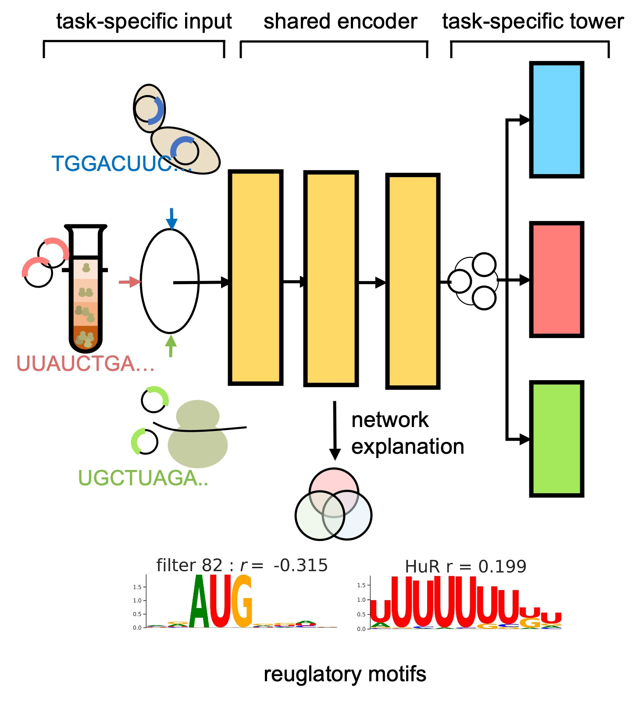

# MTtrans

MTtrans is a multi-task learning framework for integrating translation rate measurement from differet sequencing platforms 
and the discovery of robust *cis*-regulatory elements. A task

 
# Getting Start

# 