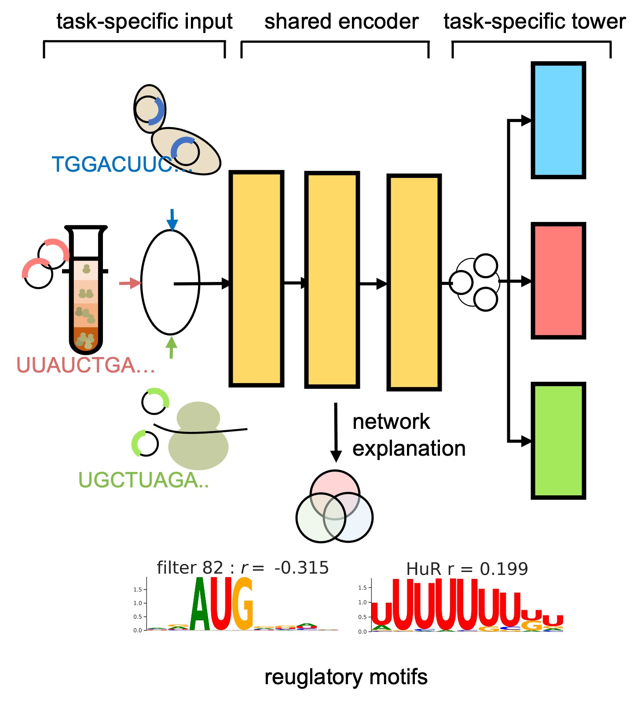

# MTtrans

MTtrans is a multi-task learning framework for integrating translation rate measurement from differet sequencing platforms 
and the discovery. The shared prepresentation captures common patterns acorss techiniques that are used to discover the robust *cis*-regulatory elements.


 

  

# Getting Start

## 1. configure the running environment
We use `conda` to manage the python packages used in this study, which 
is required for setting up the environment. If you don't have `conda` installed in your machine, please refer to [conda guide](https://docs.conda.io/projects/conda/en/latest/user-guide/install/index.html).
```shell
# clone to local and enter the main directory
git clone https://github.com/holab-hku/MTtrans
cd MTtrans

# make sure you are stay under the main folder
bash script/generate_config_js.sh

# create a new environment and install the prerequisites
conda env create -f util/environment.yml
```
 
After running the shell script `script/generate_config_js.sh`, you are supposed to see file `machine_configure.json`
under the main directory. This file locates the codes and the data that will be downloaded later.
<span style="color: red;">Please don't change the "script_dir".</span>
The "data_dir" and "pth_dir" record where the datasets and the models will be saved. The default setting is `data/` and `checkpoint/` under the this main folder.


## 2. download the datasets used in this study

There are 7 datasets used in total, including 3 massively parallel report assay (MPA), 3 ribosome profilings (RP) and 1 MPA dataset performed in the yeast system. You can download them by

```shell
# make sure you are stay under the main folder
bash script/download_training_data.sh 
```

## 2. download the datasets used in this study
